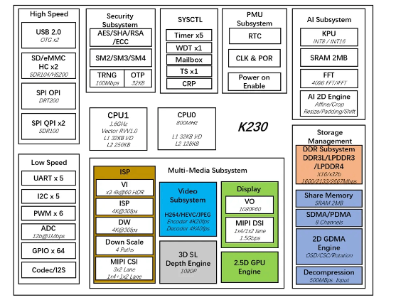

# K230 Flash

## K230 参考资料
K230 DEMO BOARD 和flash 扩展：https://www.kendryte.com/k230/zh/main/00_hardware/K230_DEMO_BOARD%E8%B5%84%E6%BA%90%E4%BD%BF%E7%94%A8%E6%8C%87%E5%8D%97.html#demo-board

相关讨论见 [PATCH v8 0/5] Add support for K230 board，合入后的官方文档见 QEMU k230 machine 文档。
https://lore.kernel.org/qemu-devel/cover.1781246408.git.chao.liu@processmission.com/
https://gitlab.com/qemu-project/qemu/-/blob/master/docs/system/riscv/k230.rst

## 一、K230 SoC 官方手册资源
嘉楠科技（Kendryte）官方已公开 K230 系列完整硬件文档，均可在官方开发者站点获取，核心手册与获取方式如下：

### 1. 核心技术手册
- **《K230 Technical Reference Manual（技术参考手册 / TRM）》**
  - 版本：V0.3.1（2024-11-18）
  - 内容：完整的芯片架构、所有外设寄存器定义、系统地址映射、功能时序说明，包含 OSPI/QSPI 控制器的详细配置、Flash Memory Window 机制与寄存器定义，是底层开发、硬件建模的核心权威依据。
  - 官方 PDF 下载：[K230_Technical_Reference_Manual_V0.3.1](https://kendryte-download.canaan-creative.com/developer/k230/HDK/K230%E7%A1%AC%E4%BB%B6%E6%96%87%E6%A1%A3/K230_Technical_Reference_Manual_V0.3.1_20241118.pdf)

- **《K230 Product Full Datasheet（完整数据手册）》**
  - 内容：芯片电气参数、封装引脚定义、外设电气特性、交直流时序参数，是硬件板级设计的核心参考。
  - 官方在线版：[K230 Full Datasheet](https://www.kendryte.com/k230/en/v1.8/00_hardware/K230_datasheet.html)

- **《K230 Product Brief（产品简介）》**
  - 内容：芯片核心规格、架构框图、外设清单的精简概览，用于快速选型与方案评估。
  - 官方在线版：[K230 Product Brief](https://www.kendryte.com/k230/en/main/K230_brief_datasheet.html)

### 2. 配套工程设计文档
- **《K230 硬件设计指南》**
  - 内容：包含 OSPI/QSPI Flash 硬件电路设计、引脚复用规则、启动模式配置、DDR 布线指引等工程化内容，明确了 OSPI Flash 的典型器件选型（如 GD25LX256E 256Mbit NOR Flash）与参考电路。
  - 官方在线版：[K230 硬件设计指南](https://developer.canaan-creative.com/k230/zh/v1.8/00_hardware/K230_%E7%A1%AC%E4%BB%B6%E8%AE%BE%E8%AE%A1%E6%8C%87%E5%8D%97.html)

---
### 3. 查询K230 寄存器和系统地址段分布的手册
https://download.kendryte.com/developer/k230/HDK/K230%E7%A1%AC%E4%BB%B6%E6%96%87%E6%A1%A3/K230_Technical_Reference_Manual_V0.3.1_20241118.pdf


## 二、K230 SoC 核心描述（基于官方手册）
K230 是嘉楠科技 Kendryte 系列的新一代 AIoT 异构 SoC，面向智能门锁、词典笔、消费级 IPC、工业扫码器等边缘智能场景设计，核心架构与特性如下：

### 1. 计算与异构架构
- **CPU 子系统**：集成 2 颗 RISC-V C908 核心，采用大小核异构设计，大核最高主频 1.6GHz，小核最高 800MHz，支持异构调度与低功耗管理。
- **AI 加速单元（KPU）**：内置新一代神经网络处理器，支持 INT8/INT16 多精度算力，主流 AI 网络利用率超过 70%。
- **专用加速引擎**：集成 2D 图形引擎、2.5D GPU、深度计算单元（DPU）、GZIP 硬件解压引擎（带宽≥400MB/s）、4096 点 FFT/IFFT 加速器。

### 2. 存储接口（与 Flash Window 直接相关）
- **内存控制器**：原生支持 LPDDR3/LPDDR4，最高 32bit 位宽，支持 2 个 rank；另有 K230D 版本为 SiP 封装，内置 1Gb LPDDR4 颗粒。
- **Flash 存储控制器**：
  - 1 路 **OSPI 控制器**：支持 4/8bit 位宽的 NOR Flash，最高支持 DDR200 / SDR166 速率，内置硬件地址映射窗口，支持 XIP 就地执行；
  - 2 路 QSPI 控制器：支持 1/2/4bit 位宽的 NOR/NAND Flash，最高 SDR100 速率；
  - 2 路 SD/MMC 接口：兼容 SD3.0、eMMC 5.0 标准。
- 其他高速接口：2 路 USB 2.0 OTG。

### 3. 音视频与通用外设
- **视频子系统**：最高 3 路 MIPI CSI 输入，集成新一代 ISP，支持 H.265 编解码、深度图提取；1 路 MIPI DSI 显示输出。
- **音频子系统**：双 DAC + 双 ADC，最高支持 8 路 PDM 数字麦克风，内置音频 Codec 与 ALC 功能。
- **低速外设**：5 路 UART、5 路 I2C、6 路 PWM，最多支持 64 路通用 GPIO + 8 路 PMU GPIO。
- **安全与电源**：内置 PUF、OTP、真随机数发生器，支持 AES、SHA、RSA 及国密 SM2/3/4 算法；集成 PMU，深度休眠待机功耗 ≤ 20μW。

### 4. Flash Memory Window 对应说明
根据官方 TRM，K230 的系统总线地址空间中，OSPI 控制器被分配了一段固定大小的**存储器映射窗口地址段**。CPU 可通过该窗口以普通内存读写的方式直接访问外部 Flash，窗口内部通过分页偏移寄存器实现“小窗口映射大容量 Flash”的分页机制，与我们之前讨论的地址翻译模型完全一致；窗口基地址、大小、分页寄存器定义均可在 TRM 的 OSPI 控制器章节查到精确数值。

位于https://www.kendryte.com/k230/zh/v1.8/00_hardware/K230_%E7%A1%AC%E4%BB%B6%E8%AE%BE%E8%AE%A1%E6%8C%87%E5%8D%97.html#flash


## K230 Flash Window 逻辑框图 与 flash window 相关设备的位置。
这是K230 芯片的逻辑框图。

K230 Flash Window 对应两个位置，分外部 Flash 访问窗口与内置 OTP 一次性 Flash 窗口
1. 外置 NOR/NAND Flash 访问窗口（OSPI/QSPI 控制器）
在框图左上角 High Speed 高速外设区域：
```plaintext
High Speed
├ USB2.0 OTG×2
├ SD/eMMC HC×2
├ SPI OPI (DRT200)  → OSPI Octal SPI（8线Flash）
└ SPI QPI ×2 (SDR160) → QSPI Quad SPI（4线Flash）
```
这两个控制器是芯片外接 Flash 的硬件接口，系统内存映射的Flash 访问窗口就由这两组 SPI 控制器实现，用来映射外部 NOR/NAND Flash 地址空间，对应硬件引脚 OSPI/QSPI 总线。

## 

## K230 Flash Memory Window 完整解析与建模实现
## 一、什么是 K230 Flash Memory Window（闪存窗口）
### 1. 核心背景
K230 外部挂载大容量 OSPI/QSPI NOR Flash（典型 256MBit/32MB、512MBit/64MB），**Flash 物理地址空间远大于 CPU 直接可寻址的片上映射窗口大小**，无法一次性把整片 Flash 线性映射到系统总线地址段。系统总线地址段通常只有 128MB，而 Flash 物理地址空间可能有 256MB、512MB 等。
Flash Memory Window（简称 Flash 分页窗口/窗口映射）是 **OSPI/QSPI Flash 控制器内置的地址分页重映射硬件机制**：
1. CPU 侧只暴露一段固定大小、连续的**窗口虚拟地址段**（Window Base）；
2. 通过控制器内**页偏移配置寄存器**（Flash Page Offset Register）指定 Flash 物理基址；
3. CPU 访问窗口内地址时，硬件自动拼接「窗口偏移 + 寄存器配置的 Flash 页基址」，换算出完整 Flash 物理地址，发起 OSPI/QSPI 总线读/写/擦除；
4. 窗口大小固定（K230 标准窗口 4MB/8MB，手册定义），切换 Flash 大段数据时只需要改写页偏移寄存器，不用修改总线内存布局。

### 2. 硬件工作原理（两级地址翻译）
设：
- `WINDOW_BASE`：CPU 总线窗口基地址（如 `0x30000000`）
- `WINDOW_SIZE`：窗口固定大小（4MB = 0x400000）
- `WIN_OFFSET_REG`：控制器分页寄存器（存储 Flash 物理页起始地址，对齐窗口大小）
- `cpu_addr`：CPU 访问的总线地址
- `flash_phys_addr`：Flash 芯片内部绝对物理地址

地址转换公式：
```
window_off = cpu_addr - WINDOW_BASE          // 窗口内局部偏移 [0, WINDOW_SIZE)
flash_phys_addr = WIN_OFFSET_REG + window_off
```
**硬件行为**
1. CPU 发起对 `0x3000XXXX` 的读操作，总线路由到 OSPI 控制器；
2. 控制器提取低 22bit 窗口偏移，加上寄存器预配置的 Flash 基址；
3. 把拼接后的 24/32bit Flash 地址通过 OSPI 总线发给 Flash 芯片；
4. Flash 返回数据，原路回传给 CPU；
5. 写/擦除操作同理，窗口地址映射自动生效。

### 3. 设计目的
1. **节省总线地址段**：不用预留几十 MB 连续总线地址给 Flash；
2. **统一指令取指/数据访问接口**：代码、常量、固件数据均可通过窗口直接内存式访问，无需 SPI 寄存器收发；
3. **简化软件分页逻辑**：访问 Flash 不同大分区仅写 1 个偏移寄存器，无需复杂 SPI 命令封装；
4. **支持 XIP（片上执行）**：将固件镜像映射进窗口，CPU 直接从外部 Flash 取指运行，不用全部加载到 DDR。

### 4. 与普通 SPI Flash 的区别
普通 SPI Flash 只能通过**寄存器收发命令+地址+数据**间接访问；
K230 Flash Window 是**硬件地址透明映射**，CPU 把 Flash 窗口当成普通内存段读写，控制器底层自动封装 OSPI 时序。

## 二、K230 Flash Window 硬件模块组成
1. **OSPI/QSPI Controller 寄存器组**
   - `WIN_BASE`：只读，硬件固化窗口总线基地址；
   - `WIN_SIZE`：只读，窗口长度（4MB）；
   - `FLASH_PAGE_OFFSET`：可写分页寄存器，Flash 物理页基址（4MB 对齐）；
   - `WIN_EN`：窗口使能位，关闭后窗口地址访问返回总线错误；
   - 状态寄存器：Flash 忙、读写完成、擦除完成标志。
2. **地址翻译组合逻辑**
   组合电路实时拼接窗口偏移 + 分页寄存器值，输出完整 Flash 物理地址到 OSPI 发送 FIFO。
3. **OSPI 物理层收发引擎**
   接收翻译后的 Flash 地址，自动发送 8线 OSPI 读/页编程/扇区擦除指令，处理 Flash 时序、Dummy Cycle、DDR/SDR 模式。
4. **数据 FIFO**
   缓存 CPU 读写数据，匹配 CPU AXI/APB 总线带宽与 Flash 串行接口带宽。

## 三、建模实现方案（分两种场景：Verilog RTL 硬件建模 / QEMU 仿真建模）
### 方案1：RTL 硬件建模（Verilog，用于SoC仿真/IP验证）
#### 模块分层
```
Top: ospi_flash_controller
├─ RegFile：窗口配置寄存器（WIN_OFFSET、WIN_EN）
├─ WindowAddrTranslate：地址翻译组合逻辑（核心窗口模块）
├─ OspiTxEngine：OSPI 命令/地址发送
├─ OspiRxEngine：Flash 数据接收
└─ FlashModel：外挂 Flash 行为模型（GD25LX256E 时序仿真）
```
#### 1. 窗口地址翻译模块核心代码（WindowAddrTranslate）
```verilog
module WindowAddrTranslate #(
    parameter WINDOW_BASE  = 32'h3000_0000,
    parameter WINDOW_MASK  = 32'h003F_FFFF, // 4MB mask
    parameter FLASH_ADDR_W = 26
)(
    input  wire [31:0] cpu_axi_addr,
    input  wire [FLASH_ADDR_W-1:0] page_offset_reg, // 分页寄存器输出
    output reg [FLASH_ADDR_W-1:0] flash_phys_addr,
    output reg window_hit // 1=地址落在窗口内
);

wire [31:0] window_local_off;

// 判断是否命中窗口地址段
assign window_hit = (cpu_axi_addr >= WINDOW_BASE) && 
                    (cpu_axi_addr <= WINDOW_BASE + WINDOW_MASK);

// 提取窗口内部偏移
assign window_local_off = cpu_axi_addr & WINDOW_MASK;

// 地址拼接输出Flash物理地址
always @(*) begin
    if(window_hit) begin
        flash_phys_addr = page_offset_reg + window_local_off[FLASH_ADDR_W-1:0];
    end else begin
        flash_phys_addr = '0;
    end
end

endmodule
```
#### 2. 寄存器模块建模要点
- 实现 APB 寄存器读写：写 `FLASH_PAGE_OFFSET` 时自动对齐窗口大小（4MB 边界，自动低 22bit 清零）；
- `WIN_EN=0` 时，`window_hit=1` 也返回 AXI SLVERR 总线报错；
- 寄存器复位默认 `page_offset_reg=0`，上电默认映射 Flash 0~4MB。
#### 3. 读写时序联动建模
1. CPU AXI 发起读，窗口命中 → 计算 `flash_phys_addr`；
2. TxEngine 自动发送 OSPI FAST READ 指令 + 24bit Flash 地址；
3. 等待 Flash Dummy Cycle，RxEngine 接收数据送入 AXI RDATA；
4. 写操作：自动发送 PAGE PROGRAM 指令，FIFO 缓存 256 字节页数据；
5. 擦除：CPU 写窗口控制寄存器触发扇区/整片擦除，等待 BUSY 标志。

### 方案2：QEMU 系统仿真建模（RISC-V K230 虚拟机，软件行为建模）
基于 QEMU `MemoryRegion` 地址空间抽象实现分页窗口重映射，**无需硬件时序，纯行为仿真**。
#### 核心原理
1. 分配一段固定 `MemoryRegion mr_window` 作为 CPU 可见 4MB 窗口总线地址；
2. 底层维护完整 Flash 镜像 `uint8_t *flash_storage`（32MB/64MB）；
3. 实现自定义 MMIO 寄存器区域（OSPI 控制寄存器），保存全局 `flash_page_base`（分页偏移）；
4. 重载窗口 MemoryRegion 的 `read/write` 回调函数：访问时做地址换算，读写底层 Flash 镜像。

#### 1. 关键数据结构（C）
```c
typedef struct K230OspiState {
    DeviceState parent;
    // Flash 全局存储镜像
    uint8_t *flash_storage;
    uint32_t flash_size;

    // Window 窗口配置寄存器
    uint32_t reg_win_offset;  // FLASH_PAGE_OFFSET
    bool win_en;              // WIN_EN 使能位

    // 窗口内存区域
    MemoryRegion mr_window;   // CPU可见4MB窗口
    MemoryRegion mr_regs;     // OSPI控制寄存器MMIO
} K230OspiState;

#define WINDOW_BASE 0x30000000
#define WINDOW_SIZE 0x400000UL // 4MB
```
#### 2. 窗口读回调函数（地址翻译核心）
```c
static uint64_t k230_flash_window_read(void *opaque, hwaddr addr, unsigned size)
{
    K230OspiState *s = opaque;
    if (!s->win_en) return 0xffffffff; // 窗口关闭返回无效值

    // 1. 计算窗口内偏移
    hwaddr win_off = addr - WINDOW_BASE;
    // 2. 拼接分页寄存器基址，得到Flash绝对地址
    hwaddr flash_phys = s->reg_win_offset + win_off;

    // 边界检查
    if (flash_phys + size > s->flash_size)
        return 0xffffffff;

    // 从Flash镜像读取对应数据
    uint64_t ret = 0;
    memcpy(&ret, s->flash_storage + flash_phys, size);
    return ret;
}
```
#### 3. 窗口写回调（模拟 Flash 编程特性）
Flash 不能直接写1，只能从1→0，写前必须擦除为0xFF；建模时增加校验逻辑：
```c
static void k230_flash_window_write(void *opaque, hwaddr addr, uint64_t val, unsigned size)
{
    K230OspiState *s = opaque;
    if (!s->win_en) return;

    hwaddr win_off = addr - WINDOW_BASE;
    hwaddr flash_phys = s->reg_win_offset + win_off;
    if (flash_phys + size > s->flash_size) return;

    // Flash 硬件约束：只能置0，不能置1
    uint8_t *dst = s->flash_storage + flash_phys;
    uint8_t src[8];
    memcpy(src, &val, size);
    for(int i=0; i<size; i++){
        dst[i] &= src[i];
    }
}
```
#### 4. 寄存器切换分页逻辑
写 `reg_win_offset` 寄存器时自动对齐窗口大小：
```c
static void ospi_reg_write(void *opaque, hwaddr addr, uint64_t val, unsigned size)
{
    K230OspiState *s = opaque;
    switch(addr){
        case REG_FLASH_PAGE_OFFSET:
            // 强制4MB对齐，低22bit清零
            s->reg_win_offset = val & (~(WINDOW_SIZE - 1));
            break;
        case REG_WIN_EN:
            s->win_en = !!(val & BIT(0));
            break;
        // 擦除命令寄存器：实现扇区擦除，对应Flash镜像整片置0xFF
        case REG_ERASE_SECTOR:
            hwaddr sec_base = s->reg_win_offset + ((val & 0xFF) << 12);
            memset(s->flash_storage + sec_base, 0xFF, 4096);
            break;
    }
}
```
#### 5. 设备初始化挂载地址空间
```c
static void k230_ospi_realize(DeviceState *dev, Error **errp)
{
    K230OspiState *s = K230_OSPI(dev);
    // 分配Flash镜像
    s->flash_storage = g_malloc0(s->flash_size);
    memset(s->flash_storage, 0xFF, s->flash_size); // Flash默认擦除值0xFF

    // 1. 挂载4MB窗口内存段，绑定读写回调
    memory_region_init_io(&s->mr_window, OBJECT(s),
                          &k230_window_ops, s,
                          "k230-flash-window", WINDOW_SIZE);
    sysbus_mmio_map(SYS_BUS_DEVICE(dev), 0, WINDOW_BASE);

    // 2. 挂载OSPI控制寄存器MMIO
    memory_region_init_io(&s->mr_regs, OBJECT(s),
                          &k230_ospi_reg_ops, s,
                          "k230-ospi-regs", 0x1000);
    sysbus_mmio_map(SYS_BUS_DEVICE(dev), 1, 0x30400000);
}
```
#### 6. DTB适配
虚拟机设备树添加OSPI节点，暴露窗口基地址与寄存器地址，与真实K230硬件一致：
```dts
ospi@30400000 {
    compatible = "canaan,k230-ospi";
    reg = <0x30400000 0x1000>, /* 控制寄存器 */
          <0x30000000 0x400000>;/* Flash窗口4MB */
    flash-size = <0x2000000>;  /* 32MB Flash */
};
```

## 四、软件使用逻辑（辅助理解建模行为）
### 1. 读取 Flash 0x1000000 位置（16MB偏移）
1. 计算目标页基址：`0x1000000` 向下4MB对齐 → `0x1000000`；
2. 写 OSPI `FLASH_PAGE_OFFSET = 0x1000000`；
3. CPU 访问窗口地址 `WINDOW_BASE + 0` → 硬件翻译为 `0x1000000`；
4. 直接读取 `*(volatile uint32_t *)0x30000000` 获取 Flash 数据。

### 2. 跨窗口连续访问
循环改写分页寄存器，逐4MB窗口遍历整片Flash，无需底层SPI命令收发。

## 五、建模校验要点（验证窗口逻辑正确性）
1. **边界测试**：窗口最后地址 `0x303FFFFF`，偏移寄存器设 `0x1FC00000`，换算后 Flash 地址 = `0x1FC00000 + 0x3FFFFF = 0x1FFFFFFF`（32MB Flash 末尾）；
2. **未对齐写入分页寄存器**：软件写非4MB对齐值，硬件/模型自动低位清零；
3. **窗口关闭测试**：`WIN_EN=0` 访问窗口返回无效数据/总线错误；
4. **Flash 写保护建模**：写操作只能将bit置0，擦除后恢复0xFF；
5. **XIP 取指验证**：把固件放在 Flash 0~4MB，窗口默认映射，CPU 直接从 `0x30000000` 取指执行。

## 六、RTL vs QEMU 建模取舍
| 建模类型 | 适用场景 | 特性 |
|--------|--------|------|
| Verilog RTL | SoC IP验证、前端仿真、时序验证 | 精准模拟OSPI时序、总线握手、硬件流水线，仿真速度慢 |
| QEMU行为建模 | 固件开发、Linux/RT-Smart 虚拟机、软件调试 | 忽略底层时序，只模拟地址映射与Flash存储行为，运行速度接近真机 |


# SPI 和OSPI/QSPI的区别
## 一、核心定位与演进关系
SPI、QSPI、OSPI 是**串行外设接口的三代演进方案**，核心目标是在串行总线的基础上，通过增加并行数据位宽、引入双数据率（DDR）等方式，大幅提升传输速率，尤其适配大容量串行 NOR Flash 的高速读取与 XIP（就地执行）需求。
演进路径为：
**标准SPI（1bit 数据位宽）→ Dual SPI（2bit）→ QSPI（4bit）→ OSPI（8bit）**

三者都属于同步串行总线，由主机提供时钟（SCLK）和片选（CS），从机跟随时钟传输数据；差异主要体现在数据通道数量、传输速率、协议复杂度和典型应用场景。

---

## 二、各自定义与核心特征
### 1. 标准 SPI（Standard SPI）
这是最基础的同步串行外设接口，由摩托罗拉最早提出。
- **信号线**：共 4 根核心线，`SCLK`（时钟）、`CS`（片选）、`MOSI`（主机发/从机收）、`MISO`（主机收/从机发）
- **双工模式**：**全双工**，MOSI 和 MISO 是单向独立通道，时钟沿下主机发数据的同时可以接收从机数据
- **数据位宽**：单 bit 串行传输，每次时钟沿只传输 1bit 数据
- **典型速率**：10~50MHz，少数高速器件可达 100MHz
- **协议特点**：协议极简，仅定义帧同步和时钟规则，命令格式由外设自定义
- **典型应用**：通用低速外设（传感器、小容量 Flash、显示屏、ADC/DAC、EEPROM 等）

### 2. QSPI（Quad SPI，四线 SPI）
SPI 的位宽扩展版本，专门针对串行 NOR Flash 优化，是目前 MCU/SoC 外置 Flash 的主流接口。
- **信号线**：`SCLK`、`CS` + `IO0~IO3` 共 4 根双向数据线（将原 MOSI/MISO 改造为双向 IO，新增 IO2/IO3）
- **双工模式**：**半双工**，数据线分时复用为发送/接收，同一时间只能单向传输
- **数据位宽**：命令/地址阶段通常沿用单线模式，数据读写阶段切换为 4bit 并行传输，位宽是标准 SPI 的 4 倍
- **典型速率**：80~133MHz SDR（单数据率，仅时钟上升沿传数据），等效吞吐量是同频标准 SPI 的 4 倍
- **关键特性**：原生支持 XIP（就地执行），控制器可自动封装 Flash 读写命令，CPU 可像访问内存一样读取 Flash
- **典型应用**：中大容量 NOR Flash（如 W25Q 系列）、固件存储、引导 ROM、轻量 XIP 代码运行

### 3. OSPI（Octal SPI，八线 SPI）
QSPI 的进一步升级，是当前高端嵌入式 SoC 的高速 Flash 标准接口，K230 即采用 OSPI 接口挂载外置 Flash。
- **信号线**：`SCLK`、`CS` + `IO0~IO7` 共 8 根双向数据线；高速模式下通常附带 `DS`（Data Strobe，数据选通）信号，由 Flash 端返回，用于接收端数据同步
- **双工模式**：**半双工**，分时复用双向数据线
- **数据位宽**：数据阶段 8bit 并行传输，位宽是 QSPI 的 2 倍；普遍支持 **DDR 双数据率**（时钟上升沿、下降沿各传 1 次数据）
- **典型速率**：100~200MHz DDR，等效吞吐量可达 200MB/s 以上，是同频 QSPI DDR 的 2 倍、标准 SPI 的十几倍
- **关键特性**：支持高速 DDR、字节掩码、包传输等高级特性，XIP 性能接近片上 SRAM
- **典型应用**：大容量高速 NOR Flash、大固件 XIP 运行、高性能嵌入式系统主存储

---

## 三、核心差异对比表
| 对比维度 | 标准 SPI | QSPI（四线） | OSPI（八线） |
|---------|---------|-------------|-------------|
| 数据通道数 | 1bit（MOSI+MISO 单向独立） | 4bit（IO0~IO3 双向） | 8bit（IO0~IO7 双向） |
| 双工类型 | 全双工 | 半双工 | 半双工 |
| 典型时钟频率 | 10~50MHz | 80~133MHz SDR | 100~200MHz DDR |
| 等效峰值吞吐量 | ~5MB/s（50MHz） | ~66MB/s（133MHz SDR） | ~400MB/s（200MHz DDR） |
| 协议复杂度 | 极低，仅定义物理层 | 中等，需支持多线模式切换、Flash专用指令 | 高，支持DDR、DS同步、高级命令集 |
| XIP 支持 | 不原生支持，需软件模拟 | 原生支持，性能一般 | 原生支持，性能接近片上内存 |
| 向下兼容性 | 基准接口 | 兼容标准 SPI 模式 | 兼容 QSPI、标准 SPI 模式 |
| 引脚数量（核心） | 4 根 | 6 根（SCLK+CS+4IO） | 9~10 根（SCLK+CS+8IO±DS） |
| 典型应用场景 | 通用低速外设 | 中容量 Flash、普通固件存储 | 大容量高速 Flash、XIP 代码运行 |
| 硬件成本与布线难度 | 最低 | 中等 | 较高 |

---

## 四、常见误区澄清
1. **误区：线越多，全双工性能越强**
   QSPI/OSPI 均为半双工，数据线是分时复用的双向通道，同一时间只能发送或接收；标准 SPI 才是真正的全双工。
   但对于 Flash 这种「发命令地址→收数据」的主从读写场景，半双工完全够用，提升位宽带来的收益远大于全双工。

2. **误区：QSPI 就是 4 根线的普通 SPI**
   QSPI 不只是物理上多了 2 根线，控制器需要支持**多线模式切换**、Flash 专用四线指令集、地址自动封装等逻辑；普通 SPI 控制器无法驱动 QSPI Flash 的四线高速模式。

3. **误区：OSPI 只是 QSPI 多了 4 根线**
   OSPI 的核心升级是 DDR 双数据率、数据选通同步、更高的时钟冗余和更完善的协议特性，性能差距远大于“4 根线”的物理差异；部分 OSPI 还支持 HyperBus 协议兼容。

---

## 五、结合 K230 Flash Window 的实际意义
回到你之前关注的 Flash Memory Window 机制，三者的差异直接决定了硬件架构设计：
- **标准 SPI**：只能通过寄存器手动收发命令、地址、数据，CPU 无法直接内存式访问，不支持 XIP，无法实现 Flash 窗口映射。
- **QSPI/OSPI**：控制器内置地址翻译与自动命令封装逻辑，配合 Flash Window 分页机制，CPU 可以像访问普通内存一样直接读写 Flash，支持 XIP 就地执行代码。
- **K230 选用 OSPI**：8bit 位宽 + DDR 模式带来的高读取速度，可满足大固件、AI 模型、XIP 运行的性能需求；同时用 4MB 固定窗口机制，解决了“大容量 Flash 占用过多系统总线地址段”的问题。

# OSPI、QSPI、标准 SPI 地址映射区分
参考：K230_Technical_Reference_Manual_V0.3.1_20241118.pdf 1.5小节
原因解析，结合给出的地址映射分段说明
1. 硬件控制器独立寄存器基址区分（0x9158xxxx 区间）
0x9158_2000~0x9158_4000：SPI QOPI x2 控制器寄存器配置区
0x9158_4000~0x9158_5000：SPI OPI 控制器寄存器配置区
QOPI、OPI 是两套独立硬件控制器，各自拥有专属寄存器组，所以分配两段不同外设寄存器地址，用于配置时序、指令、读写模式、时钟等硬件参数，CPU 通过不同地址访问对应控制器的控制寄存器。
2. XIP 闪存映射地址独立（0xC000_0000~0xC800_0000）
0xC000_0000~0xC800_0000 是OPI Flash XIP 地址窗口，这是内存映射只读访问空间，和上面控制器寄存器地址完全不是一类用途：
0x9158xxxx：控制器配置寄存器，用来操控 Flash 硬件；
0xC0000000：Flash 存储内容直接映射内存窗口（XIP 片上执行），CPU 可直接读取 Flash 里的程序 / 数据。
3. QOPI、OPI 协议硬件规格不同，控制器物理分离
QOPI（四线 SPI）、OPI（八线 SPI）总线带宽、指令集、时序逻辑硬件电路相互独立：
二者引脚驱动、数据位宽、读写命令寄存器定义不一样；
芯片内部总线架构为每个独立外设控制器分配互不重叠的寄存器地址段，避免地址访问冲突；
仅 OPI 硬件支持 XIP 内存映射窗口，所以只有 OPI 分配了 128MB 的 C 段地址空间，QOPI 无对应的 XIP 映射区间。
总结
寄存器地址区分：QOPI、OPI 是两套独立硬件控制器，寄存器基址分开，方便独立配置；
功能地址分离：0x9158 开头是控制寄存器，0xC000 开头是 Flash 数据 XIP 映射窗口，用途完全不同；
硬件能力差异：OPI 支持 XIP 片上执行，额外分配大容量内存映射地址段，QOPI 无此功能，因此没有对应地址区间。

## 一、XIP 含义（结合手册 K230 硬件说明）
XIP 全称 eXecute In Place，片上就地执行，是 Flash 的内存映射访问机制：
硬件把 SPI OPI Flash 的存储区域直接映射到 CPU 系统总线地址段 0xC000_0000~0xC800_0000；
2 CPU 无需把 Flash 数据搬运到 DDR/SRAM，可直接通过读取该段地址，取 Flash 内代码、数据运行；
3 仅 K23 的OPI 八线 Flash 控制器支持该功能，QSPI 四线控制器无 XIP 映射窗口。
二、0xC000_0000~0xC8000000 地址段实际存储位置
逻辑层面：该地址是系统总线虚拟映射地址，属于芯片内部 AXI 系统地址空间；
物理存储层面：该地址段不位于片内 DDR、SRAM，物理介质是外接 SPI OPI Flash 芯片；
补充区分两段关键地址：
0x9158_4000~0x9158_5000：OPI 控制器配置寄存器，在芯片内部外设模块，用于控制 Flash 读写时序、模式；
0xC000_0000~0xC800：XIP 映射窗口，访问此地址时，硬件自动转发读指令到外部 OPI Flash，读取 Flash 真实存储内容。
空间大小匹配：映射区间 128MB，对应外接 OPI Flash 最大 128MB 寻址范围。
补充区分 QOPI
手册仅分配 QOPI 控制器寄存器段0x9158_2000~0x9158_4000，没有配套 XIP 地址窗口，四线 QSPI Flash 不支持就地执行。